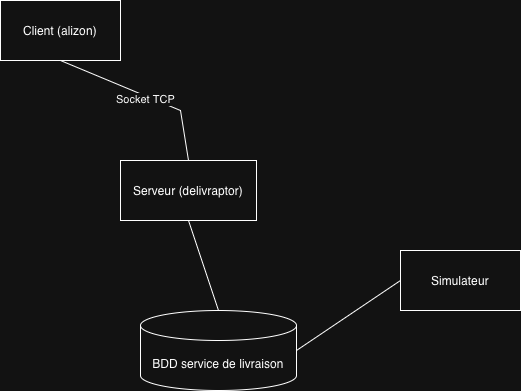

# **PROTOCOLE DÉLIVRAPTOR - Documentation Technique**

## 1. **Introduction**

**Version** : 1.0  
**Date** : 12/01/26  
**Auteur** : Alizon et les sept nains

### 1.1 Objectif

Protocole client-serveur pour la gestion de livraisons entre Alizon et Délivraptor.

## 2. **Architecture Client-Serveur**



### 2.1 Schéma de communication

```
Client (Alizon)        Serveur (Délivraptor)
     |                                               |
     |---- COMMANDE ---------->|
     |                                               |
     |<--- RÉPONSE ----------------|
     |                                               |
```

## 3. **Format des messages**

### 3.1 Structure générale

- **Une commande = une ligne**
- **Terminaison** : `\n`
- **Sensible à la casse** : TOUTES LES COMMANDES EN MAJUSCULES
- **Encodage** : ASCII pur (pas d'accents)

### 3.2 Format de base

```
COMMANDE [paramètre1] [paramètre2] ... [paramètreN]\n
```

## 4. **Commandes disponibles**

### 4.1 `AUTH` - Authentification

**Syntaxe :**

```
AUTH <username> <md5_hash>
```

**Paramètres :**

- `username` : Identifiant client (ex: "alizon")
- `md5_hash` : Hash MD5 du mot de passe (32 caractères hexa)

**Exemple :**

```
AUTH alizon e10adc3949ba59abbe56e057f20f883e
```

**Réponses possibles :**

```
AUTH_SUCCESS
ERROR AUTH_FAILED
ERROR INVALID_MD5_FORMAT
ERROR MISSING_CREDENTIALS
ERROR ALREADY_AUTHENTICATED
```

### 4.2 `CREATE` - Création de bordereau

**Syntaxe :**

```
CREATE <commande_id>
```

**Paramètres :**

- `commande_id` : Identifiant unique de commande Alizon (50 caractères max)

**Exemple :**

```
CREATE 123456789
```

**Réponses possibles :**

```
BORDEREAU 3847562019
ERROR NOT_AUTHENTICATED
ERROR MISSING_COMMANDE_ID
ERROR CAPACITE
ERROR DB_QUERY
ERROR DB_INSERT
```

**Comportement :**

- Si la commande existe déjà, retourne le même bordereau
- Vérifie la capacité disponible (max configuré)

### 4.3 `STATUS` - Consultation d'un colis

**Syntaxe :**

```
STATUS <num_bordereau>
```

**Paramètres :**

- `num_bordereau` : Numéro de bordereau (10 chiffres)

**Exemple :**

```
STATUS 3847562019
```

**Réponse normale :**

```
ETAPE <num>|<localisation>|<date>|<type_livraison>|<raison_refus>
```

**Exemple de réponse :**

```
ETAPE 5|Plateforme régionale Lyon|2026-01-09 14:32:05||
```

**Réponse avec image (étape 9) :**

```
ETAPE 9|Chez destinataire|2026-01-09 14:32:05|ABSENT|
---IMAGE---
[binaire image JPEG]
```

**Réponses d'erreur :**

```
ERROR NOT_AUTHENTICATED
ERROR MISSING_BORDEREAU
ERROR NOT_FOUND
ERROR DB_QUERY
```

### 4.4 `HELP` - Aide

**Syntaxe :**

```
HELP
```

**Réponse :** Documentation texte formatée des commandes.

### 4.5 `QUIT` / `EXIT` - Déconnexion

**Syntaxe :**

```
QUIT
```

ou

```
EXIT
```

**Réponse :**

```
BYE
```

## 5. **Format des réponses**

### 5.1 Structure des réponses

```
SUCCÈS: <données>
ERREUR: ERROR <type_erreur>
```

### 5.2 Format `ETAPE`

```
ETAPE <etape>|<localisation>|<date>|<type>|<raison>
```

**Champs :**

1. **etape** : Numéro de l'étape (1-9)
2. **localisation** : Lieu actuel du colis
3. **date** : Date de la dernière mise à jour (format MySQL DATETIME)
4. **type** : Type de livraison (vide sauf étape 9)
   - `MAINS_PROPRES` : Livré en mains propres
   - `ABSENT` : Livré en l'absence
   - `REFUSE` : Refusé
5. **raison** : Raison du refus (vide sauf refus)

### 5.3 Codes d'erreur

| Code erreur             | Description                | Solution                         |
| ----------------------- | -------------------------- | -------------------------------- |
| `NOT_AUTHENTICATED`     | Client non authentifié     | Exécuter `AUTH` d'abord          |
| `AUTH_FAILED`           | Identifiants incorrects    | Vérifier username/mdp            |
| `INVALID_MD5_FORMAT`    | Hash MD5 invalide          | Générer un nouveau hash          |
| `MISSING_CREDENTIALS`   | Paramètres manquants       | Fournir tous les paramètres      |
| `ALREADY_AUTHENTICATED` | Déjà authentifié           | Continuer sans ré-auth           |
| `MISSING_COMMANDE_ID`   | ID commande manquant       | Spécifier un ID commande         |
| `MISSING_BORDEREAU`     | Bordereau manquant         | Spécifier un numéro de bordereau |
| `CAPACITE`              | Capacité maximale atteinte | Réessayer plus tard              |
| `NOT_FOUND`             | Bordereau non trouvé       | Vérifier le numéro               |
| `DB_QUERY`              | Erreur base de données     | Contacter l'administrateur       |
| `DB_INSERT`             | Erreur insertion BD        | Contacter l'administrateur       |
| `UNKNOWN_COMMAND`       | Commande inconnue          | Vérifier la syntaxe              |

## 6. **Étapes de livraison**

| Étape | Localisation            | Description                       |
| ----- | ----------------------- | --------------------------------- |
| **1** | Entrepôt Alizon         | Bordereau créé, colis chez Alizon |
| **2** | En transit              | Prise en charge par transporteur  |
| **3** | Plateforme transporteur | Arrivée chez transporteur         |
| **4** | En transit              | Départ vers plateforme régionale  |
| **5** | Plateforme régionale    | Arrivée plateforme régionale      |
| **6** | En transit              | Départ vers centre local          |
| **7** | Centre local            | Arrivée centre local              |
| **8** | En livraison            | Départ pour livraison finale      |
| **9** | Chez destinataire       | Livré/absent/refusé               |

## 7. **Gestion de la capacité**

### 7.1 Concept

- Capacité configurable au démarrage (`--capacity`)
- Seulement les colis aux étapes **1 à 4** comptent dans la capacité
- Un colis à l'étape **5** libère une place
- File gérée via table `_delivraptor_file_prise_en_charge`

### 7.2 Comportement

```
CREATE → si capacité disponible → insertion dans file
STATUS étape 5 → suppression de la file
CREATE → vérification file avant création
```

## 8. **Authentification**

### 8.1 Format du fichier d'authentification

```
username:md5hash
username2:md5hash2
# Commentaire
```

### 8.2 Génération du hash MD5

```bash
# Linux
echo -n "motdepasse" | md5sum

# PHP
<?php echo md5("motdepasse"); ?>
```

## 9. **Gestion des images (étape 9)**

### 9.1 Format

```
ETAPE 9|...|ABSENT|
---IMAGE---
[binaire JPEG]
```

### 9.2 Caractéristiques

- Seulement pour `ABSENT` (livraison en absence)
- Format JPEG recommandé
- Taille max conseillée : 1MB
- Terminaison : fin de socket (EOF)

## 10. **Exemples complets**

### 10.1 Session réussie

```
Client: AUTH alizon e10adc3949ba59abbe56e057f20f883e
Server: AUTH_SUCCESS

Client: CREATE 1001
Server: BORDEREAU 3847562019

Client: STATUS 3847562019
Server: ETAPE 1|Entrepôt Alizon|2026-01-09 14:32:05||

Client: QUIT
Server: BYE
```

### 10.2 Session avec erreurs

```
Client: CREATE 1002
Server: ERROR NOT_AUTHENTICATED

Client: AUTH alizon mauvais_hash
Server: ERROR AUTH_FAILED

Client: AUTH alizon e10adc3949ba59abbe56e057f20f883e
Server: AUTH_SUCCESS

Client: CREATE 1002
Server: BORDEREAU 9876543210
```

## 11. **Sécurité**

### 11.1 Mesures

- Authentification obligatoire
- Hash MD5 des mots de passe
- Validation des formats
- Timeout de connexion (10s)

### 11.2 Limitations

- Pas de chiffrement (protocole en clair)
- Pas de protection contre les attaques brute-force

## 12. **Codes de retour serveur**

### 12.1 En cas de succès

Le serveur reste actif après chaque commande.

### 12.2 En cas d'erreur

- Erreur client : message d'erreur, connexion maintenue
- Erreur serveur : déconnexion immédiate

## 13. **Annexes**

### 13.1 Fichiers de configuration

- `auth.txt` : Fichier d'authentification
- `delivraptor.log` : Fichier de logs
- Options ligne de commande :
  ```bash
  ./delivraptor_server --port 8080 --capacity 5 --auth auth.txt --log delivraptor.log
  ```

### 13.2 Tables MySQL

```sql
-- Colis en cours
_delivraptor_colis

-- Gestion capacité
_delivraptor_file_prise_en_charge

-- Historique
_delivraptor_colis_historique
```

### 13.3 Scripts utilitaires

- `client.php` : Client de test
- `simulateur.php` : Simulation avancement colis
- `test_integration.sh` : Tests complets

## 14. **Dépannage**

### 14.1 Problèmes courants

1. **Connexion refusée** : Vérifier que le serveur tourne (`netstat -tulpn | grep :8080`)
2. **Authentification échouée** : Vérifier le hash MD5
3. **Capacité atteinte** : Attendre ou augmenter capacité
4. **Bordereau non trouvé** : Vérifier le numéro

### 14.2 Logs

Consulter `delivraptor.log` pour les détails.

---

## **Résumé des commandes**

| Commande | Syntaxe              | Authentification | Réponse                    |
| -------- | -------------------- | ---------------- | -------------------------- |
| `AUTH`   | `AUTH user hash`     | Non              | `AUTH_SUCCESS` ou `ERROR`  |
| `CREATE` | `CREATE commande_id` | Oui              | `BORDEREAU num` ou `ERROR` |
| `STATUS` | `STATUS bordereau`   | Oui              | `ETAPE ...` ou `ERROR`     |
| `HELP`   | `HELP`               | Non              | Texte d'aide               |
| `QUIT`   | `QUIT`               | Non              | `BYE`                      |


